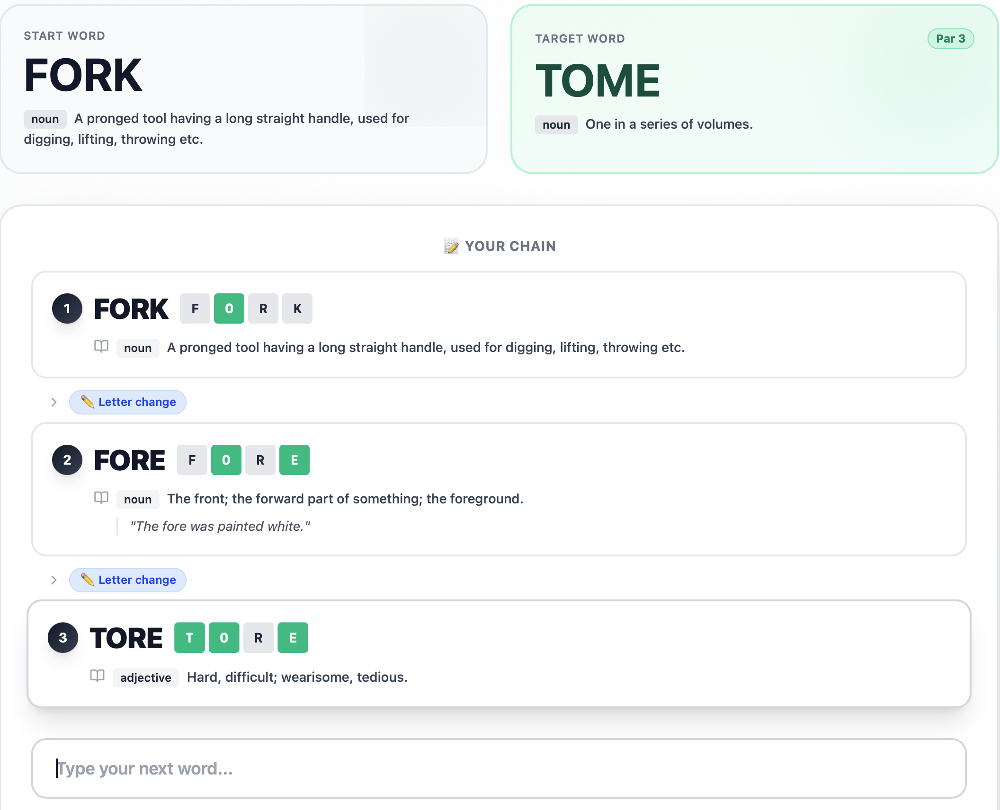
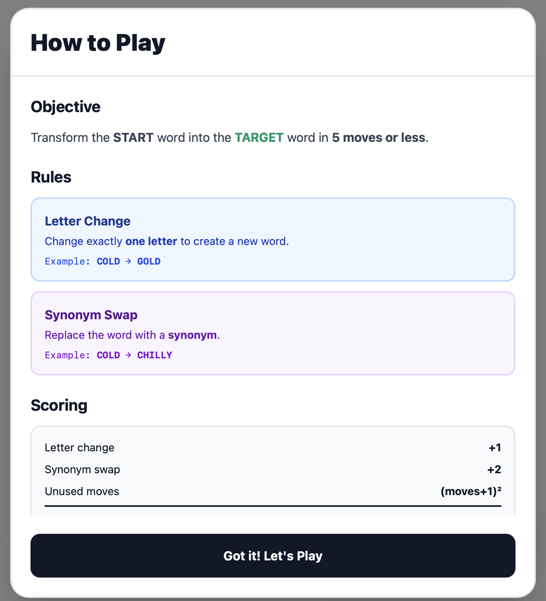
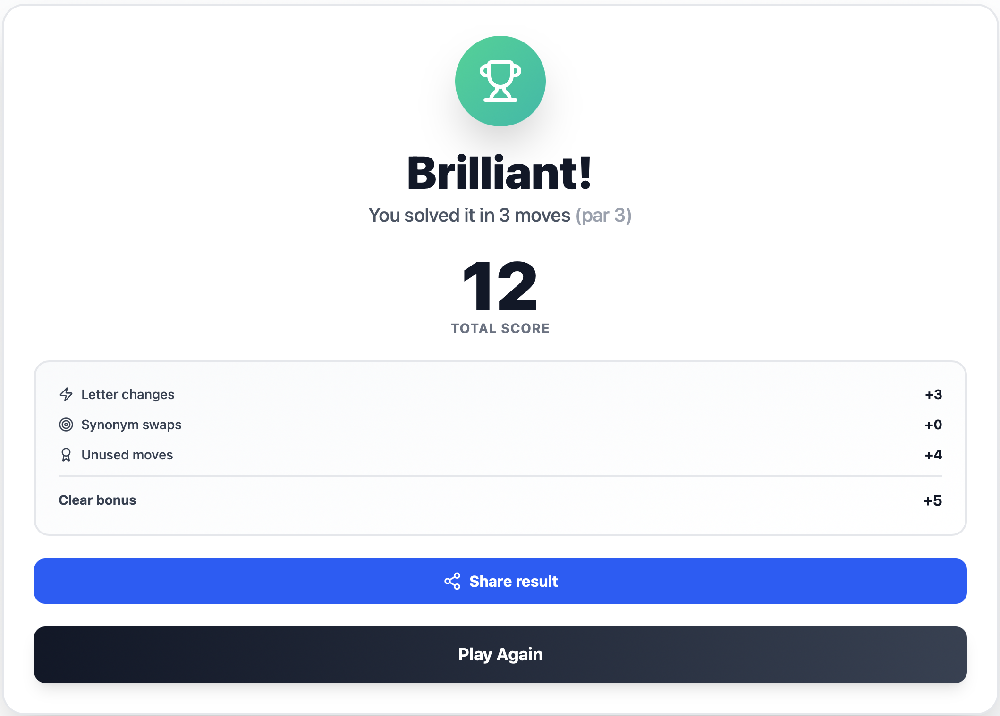

# Pivot


A word-ladder game inspired by Lewis Carroll's 1877 puzzle and modern takes like Wordle and Weaver. You change one letter at a time (or swap to a synonym) until the start word becomes the target, in five moves or fewer.

I built this after getting hooked on Weaver and wondering whether decent puzzles could be generated automatically instead of hand-picked. Turns out yes, if you're willing to think about the dictionary as a graph.

## Features

- Daily puzzle that's identical for every player on a given UTC day
- Random mode plus easy / medium / hard (par 3, 4, 5)
- Antonym themed mode (start and target are opposites)
- Hint that reveals the next optimal move, with a small score penalty
- Give up reveals the full shortest solution
- Wordle-style emoji share of your chain after a win
- Streak and stats tracked per browser
- On-screen keyboard for phone play
- Letter-tile feedback showing positions that already match the target

## Screenshots

| Gameplay | How to Play | Win screen |
| --- | --- | --- |
|  |  |  |

## Stack

React 19, Vite 7, Tailwind v4 on the frontend. Express 4 on Node 20 for the backend, plus the Datamuse API for synonyms and antonyms. Vitest for tests on both sides.

## At a glance

- 39 tests across 6 files, frontend and backend
- Frontend bundle: 111 KB gzipped (357 KB raw)
- Word graph (4,030 nodes, 923 endpoint words) built in ~7 ms at boot
- Three difficulty pools (200 puzzles each) plus a 500-puzzle random pool ready in ~1.4 s
- Daily puzzle generated on demand from a date hash, no DB

## How it works

The frontend is a single-page React app. The backend is a small Express server that builds an in-memory adjacency graph of the dictionary at startup, then serves puzzle generation, move validation, and shortest-path solving over a REST API.

### Wildcard-bucket graph construction

The naive way to build a word-ladder graph compares every pair of words, which is O(N²). For 4,030 4-letter words that's ~16M string diffs. Instead I group words by every possible single-character wildcard (e.g. `bake` goes into the buckets `*ake`, `b*ke`, `ba*e`, `bak*`). Words sharing a bucket are exactly the words that differ by one letter. Build is O(N · L), and the 4,030-word graph constructs in about 7 ms. See [`buildGraph`](server/wordGraph.js).

### Split playable / endpoint vocabularies

Using one dictionary for both endpoints and intermediate ladder steps forces a bad tradeoff. A tight common-word list lacks density for varied multi-step paths, while a loose Scrabble list produces obscure starts like `AAHS → ABBA`. Pivot uses two lists: ~4,030 Weaver words for the playable graph, and the intersection with SCOWL tiers 10–20 (~923 words) as the endpoint pool. Every puzzle's start and target are recognizable, but the path through the middle can use the wider vocabulary.

### BFS for both solving and generating

A word ladder is a shortest-path problem on an unweighted graph, so BFS gives you the optimal answer. The same routine is reused for hints (BFS from the current word to the target) and puzzle generation (pick a random endpoint, run BFS, sample any other endpoint that lands at distance 3–5). See [`bfsDistances` / `shortestPath`](server/wordGraph.js).

### Deterministic daily puzzles

The daily puzzle has to be identical for every player regardless of which server instance handles their request, with no database. I hash the date string with FNV-1a and use it to seed the start and target picks. Same date, same puzzle. See [`generateDailyPuzzle`](server/puzzleGen.js).

### Async themed pool

Antonym pairs require Datamuse API calls. Synchronously at boot would add several seconds to startup, and per-request would hit rate limits. The antonym pool builds in the background after server start; `/api/puzzle?theme=antonym` returns 503 until it's ready. See [`buildAntonymPool`](server/themedGen.js).

### Stats live in the browser

Streaks and win rate are stored in localStorage. No accounts, no schema, no auth. Stats don't sync across devices, which is fine for v1.

## Known limitations

- Stats vanish if you clear browser storage. There's no recovery.
- Datamuse occasionally times out, which makes antonym mode flaky for the first minute after a deploy.
- The word list is fixed at the Weaver dictionary. Players can't suggest additions.
- Cold deploys rebuild the graph each time. Cheap (~7 ms), not free.
- Hint logic just shows the next BFS step, so it can recommend a move that's *technically* optimal but feels weird (an early synonym jump, for instance).

## Quickstart

```bash
git clone https://github.com/<you>/pivot.git
cd pivot
npm install
cd server && npm install && cd ..
npm run dev:all   # Vite on 5173, Express on 5174
```

Then open http://localhost:5173.

## API

- `GET /api/health` returns service status, vocab and pool sizes.
- `GET /api/puzzle` returns a random puzzle. Optional `?difficulty=easy|medium|hard` or `?theme=antonym`.
- `GET /api/puzzle/daily` returns today's deterministic puzzle. Optional `?date=YYYY-MM-DD`.
- `GET /api/validate?from=…&word=…` checks whether a move is legal.
- `GET /api/neighbors/:word` lists all one-letter neighbors.
- `GET /api/solution?start=…&target=…` returns the shortest BFS path.

## Development

```bash
npm run dev:all          # web + api
npm run dev              # web only
npm run dev:server       # api only
npm test                 # frontend tests
cd server && npm test    # backend tests
npm run build
npm run lint
```

## Project layout

```
src/
  components/
    game/              WordCard, ChainDisplay, GameOver, ...
    Keyboard.jsx       on-screen mobile keyboard
    ShareCard.jsx      Wordle-style emoji share
    StatsModal.jsx     streak + stats display
  services/
    api.js             REST client
    stats.js           localStorage stats schema
  HomePage.jsx
  MenuPage.jsx
  PivotGame.jsx        gameplay orchestrator
  constants.js
server/
  data/weaver_words.txt    4,030-word dictionary
  wordGraph.js             graph build, BFS, shortest path
  puzzleGen.js             puzzle pool + deterministic daily generator
  themedGen.js             async antonym pool builder
  index.js                 Express app + routes
```

## Roadmap

- Postgres-backed leaderboards with anonymous user IDs
- Multiple word lengths (3, 5, 6 letters)

## Working on this

A few habits I try to keep:

- One logical change per commit. Smaller is almost always better.
- Conventional prefixes: `feat:`, `fix:`, `refactor:`, `docs:`, `test:`, `chore:`.
- Run `npm test` and `cd server && npm test` before pushing.

If you want the soft commit-message check, install the local hook:

```bash
cp scripts/commit-msg.sample .git/hooks/commit-msg
chmod +x .git/hooks/commit-msg
```

It warns (does not block) on very short messages or oversized diffs.

## Credits

- Word list adapted from [Weaver](https://wordwormdormdork.com/) and the SCOWL English wordlist tiers
- Definitions from [dictionaryapi.dev](https://dictionaryapi.dev/)
- Synonyms and antonyms from [Datamuse](https://www.datamuse.com/api/)

## License

MIT
